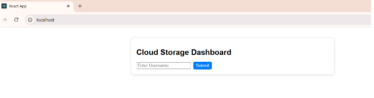
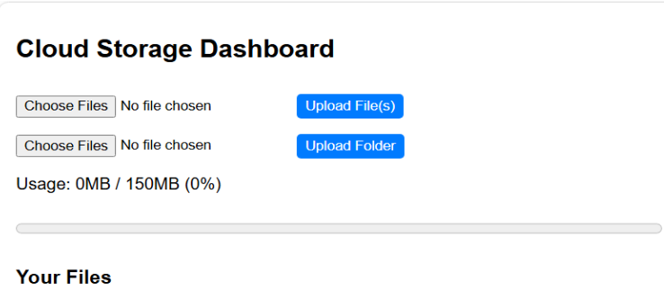
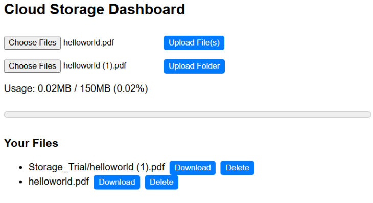
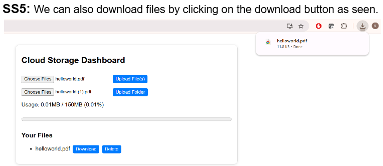
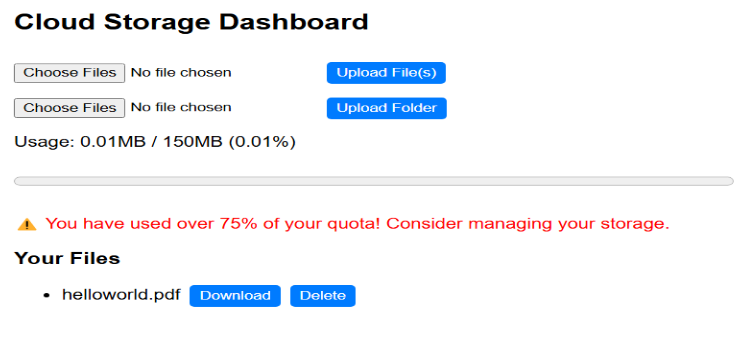

# Cloud Storage Microservice

## Overview
The Cloud Storage Microservice is a containerized application that enables users to upload, view, download, and delete files or folders on a cloud backend. It tracks storage usage and proactively alerts users when storage consumption exceeds 75%. The service uses Amazon S3 for storage, provides a modern React.js interface, and is orchestrated with Docker Compose for easy deployment.

## Features
- **File & Folder Upload**: Upload both individual files and entire folders to Amazon S3 through a user-friendly web interface.
- **View & Download**: Browse and download stored files/folders directly from the web app.
- **Delete Functionality**: Remove unwanted files and folders to manage storage efficiently.
- **Usage Tracking**: Monitors the total storage used by the user.
- **Storage Alerts**: Sends notifications or alerts when storage usage exceeds 75% of the allowed quota.
- **RESTful API**: FastAPI-based backend exposes endpoints for all major operations.
- **Containerized Deployment**: Quick setup and scaling using Docker and Docker Compose.

## Tech Stack
- **Backend**: FastAPI (Python), Boto3 (AWS SDK for Python)
- **Cloud Storage**: Amazon S3
- **Frontend**: React.js
- **Containerization**: Docker, Docker Compose

## Steps/Setup Instructions

1. **Clone the Repository**
   ```bash
   git clone https://github.com/Bhavish1517/Cloud_Storage.git
   cd Cloud_Storage
   ```

2. **Unzip/Prepare the Project**
   - If you downloaded the project as a zip, unzip it and navigate into the folder containing `docker-compose.yml`.

3. **Configure Environment Variables**
   - Ensure your AWS credentials and S3 bucket information are set in a .env file that you will have to create in the main directory.

4. **Build the Containers**
   ```bash
   docker-compose build
   ```

5. **Start the Application**
   ```bash
   docker-compose up -d
   ```

6. **Access the Interface**
   - Open your browser and go to: [http://localhost:80](http://localhost:80)

7. **Stopping the Application**
   ```bash
   docker-compose down
   ```

## Sample Screenshots

- *Home Login Page*  
  

- *Dashboard Page*  
  

- *Upload File/Folder*  
  

- *Downlaod File/Folder*  
  

- *Sample Storage Alert*  
  

---
